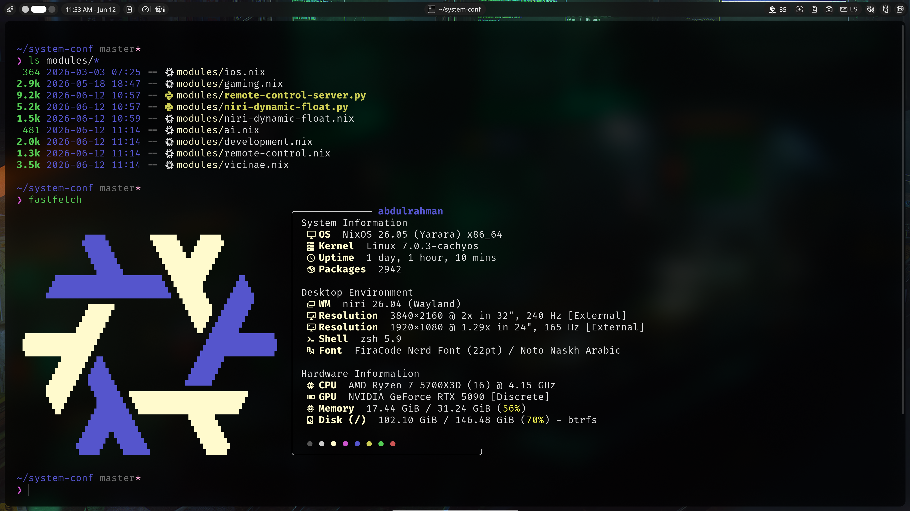
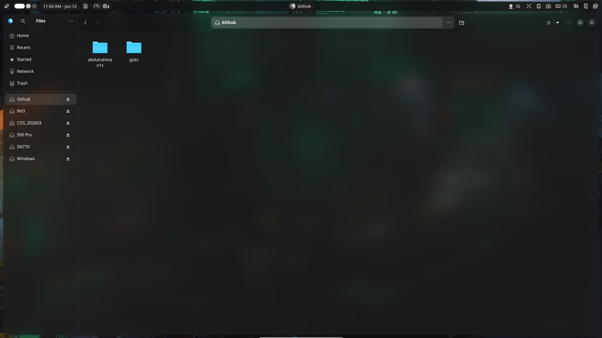
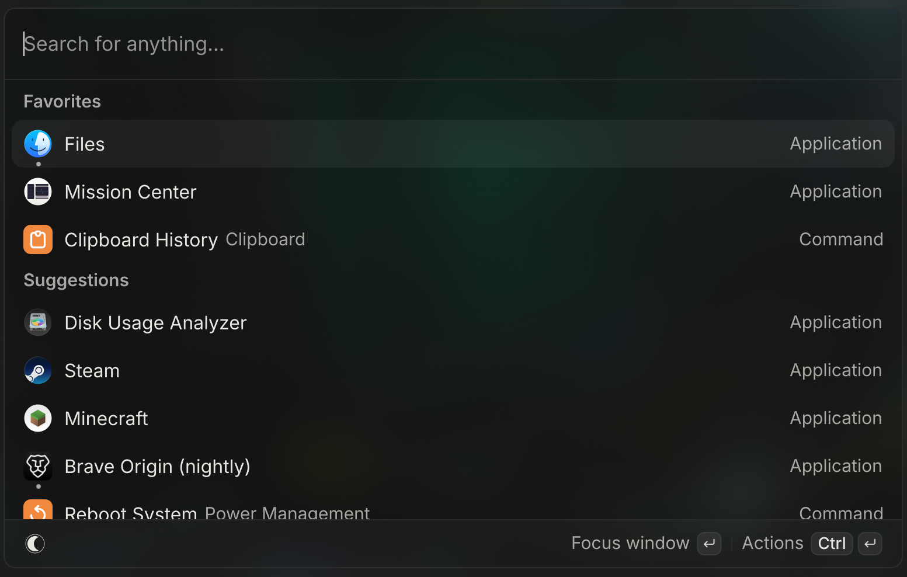

```
 _   _ _______   ______   _____
| \ | |_   _\ \ / / __ \ / ____|
|  \| | | |  \ V / |  | | (___
| . ` | | |   > <| |  | |\___ \
| |\  |_| |_ / . \ |__| |____) |
|_| \_|_____/_/ \_\____/|_____/

        my personal NixOS config
```

This is the NixOS configuration for my machine, `abdulrahman@nixos`. It's not a
framework or a starter template - just the actual system I use every day, kept
in a flake so I can rebuild it from scratch.

A lot of it is ordinary NixOS. The parts I actually spent time on are the
**niri desktop**, the **app sandboxing**, an **ephemeral root** that wipes back
to blank on every boot, and some **boot / kernel / terminal tuning**, so that's
mostly what these notes cover. If you run NixOS, there might be a couple of ideas
worth borrowing.

```text
Limine ─▶ ly ─▶ niri ─▶ noctalia ─▶ apps, each in its own bubblewrap sandbox
            │
            ├─ helper scripts in config/niri/ wiring niri's IPC into behavior
            ├─ vicinae launcher with Nix-built extensions
            └─ a small LAN HTTP server I drive from iOS Shortcuts
```

## A look at it

Everything is a dark [adw-gtk3](https://github.com/lassekongo83/adw-gtk3) theme
(GTK 3 + 4), tweaked with `nwg-look`. Ghostty with the Pure prompt and fastfetch,
and Nautilus:

<p>
  
  
</p>

The vicinae launcher (`Mod+S`):



## Boot: Limine, with Windows

[`hardware-configuration.nix`](hardware-configuration.nix) uses
[Limine](https://limine-bootloader.org/) instead of GRUB - EFI, a 4K graphical
menu in a Catppuccin Mocha palette, branding stripped, 3-second timeout.

The dual-boot entry is the bit I like. Rather than hardcoding a path to
`bootmgfw.efi`, it uses Limine's `efi_boot_entry` protocol:

```kdl
/Windows
    protocol: efi_boot_entry
    entry: Windows Boot Manager
```

That resolves the firmware's "Windows Boot Manager" EFI variable at boot time,
so Windows keeps working even when an update moves its loader - there's no
chainload path to maintain. The Windows NTFS volumes also `x-systemd.automount`
under `/mnt` (with `windows_names` + `nofail`), so I can browse them from NixOS
when I need to.

## Ephemeral root and home

Both the `root` and `home` btrfs subvolumes are rolled back to an empty snapshot
on every boot. Nothing survives a reboot unless it's on an explicit keep-list, so
the machine always comes up in the same clean state and any state that matters is
something I consciously decided to keep.

[`system/impermanence.nix`](system/impermanence.nix) is two pieces:

- A `rollback` service that runs **in the initrd**, before the real root mounts.
  It deletes `root` and `home` (and any nested subvolumes) and restores them from
  pristine `*-blank` snapshots:

  ```nix
  for sub in root home; do
    btrfs subvolume delete "/btrfs-tmp/$sub"
    btrfs subvolume snapshot "/btrfs-tmp/$sub-blank" "/btrfs-tmp/$sub"
  done
  ```

- [nix-community/impermanence](https://github.com/nix-community/impermanence)
  bind-mounts the keep-list back out of a third subvolume, `/persist`, which is
  never wiped. System state (`/var/lib/nixos` for stable uid/gid maps,
  NetworkManager connections, Bluetooth pairings, Docker, the journal) and a
  hand-picked set of `$HOME` paths (the flake repo itself, `~/.ssh`, the browser
  profile, shell history, app logins) live there.

Two things this buys, both nice: the keep-list *is* the documentation of what
state the system actually depends on, and because `/persist` is mounted in the
initrd (`neededForBoot`) the agenix identity at `/persist/root/.ssh/id_ed25519`
is readable early enough to decrypt secrets before any service wants them.

## The niri desktop

[niri](https://github.com/YaLTeR/niri) is a scrollable-tiling compositor -
windows live on an infinite horizontal strip instead of a grid. Out of the box
it's pretty minimal, so most of what makes it usable for me lives in the helper
scripts under [`config/niri/`](config/niri/), which mostly just wrap `niri msg`
IPC into behavior I wanted.

A few of the keybinds:

| Keys | What it does |
| --- | --- |
| `Mod+X` / `Mod+Shift+X` | New terminal, focused on *that* window; Shift cycles existing ones |
| `Mod+B` | Raise Brave - press again to jump back to where you were |
| `Mod+M` / `Mod+Y` | YouTube Music as a small floating PWA / YouTube maximized, raise-or-launch |
| `Mod+Tab` | Alt-tab, but only within the focused app's windows |
| `Mod+F` | Maximize if tiled, fullscreen if floating |
| `Mod+D` / `Mod+Shift+D` | Peek the floating window into a corner / swap the two corners |
| `Mod+scroll` | Move between columns (wraps; also works over the floating layer) |
| `Shift+scroll` / `Mod+Shift+scroll` | Switch workspace / move the column to the next one |
| `Win+Space` | Toggle keyboard US ⇄ Arabic |

Every bind has a `hotkey-overlay-title`, so `Mod+Shift+/` shows a readable cheat
sheet.

The scripts behind them:

- **[`niri-launch-or-focus`](config/niri/niri-launch-or-focus)** - launch the
  app if it's closed, raise it if it's open, cycle if there are several. When it
  launches it polls niri's window list briefly so it focuses the *new* window
  instead of racing the compositor. `--toggle-previous` makes the key bounce you
  back to the previous window if the app's already focused.

- **[`peek-floating-window`](config/niri/peek-floating-window)** - the one I'm
  most happy with. It stashes floating windows into the bottom corners as small
  slivers, two slots, LIFO restore. It re-peeks the window you just put away
  before popping a different corner, can be driven from hot corners via
  `waycorner`, swaps corners, and bumps the older slot when both are full. It
  tags peeked windows with niri's urgency flag and [`rules.kdl`](config/niri/rules.kdl)
  styles those (dimmed, rounded, no shadow), so urgency doubles as the "is
  peeked" marker. It moves windows with relative deltas to work around a couple
  of niri CLI quirks - the comments explain why.

- **[`niri-dynamic-float`](modules/niri-dynamic-float.nix)** - niri only checks
  `open-floating` when a window opens, so windows that change their title later
  (Brave DevTools detaching, a Bitwarden popup) don't get caught. This is a
  small systemd service that watches niri's event stream and floats them after
  the fact. Rules are declared in Nix and baked into the
  [Python](modules/niri-dynamic-float.py) at build time.

- The smaller ones: [`cycle-same-app`](config/niri/cycle-same-app) (app-scoped
  alt-tab), [`focus-column`](config/niri/focus-column) (runs `focus-tiling`
  first so scroll doesn't no-op over a float),
  [`maximize-window`](config/niri/maximize-window) (float vs. tile), and
  [`niri-launch-or-focus-webapp`](config/niri/niri-launch-or-focus-webapp) for
  treating Brave PWAs as real apps.

[`rules.kdl`](config/niri/rules.kdl) also gives any window that's currently a
screencast target a red focus ring, so I don't share the wrong one into a call.
Workspaces are named (`main` for browsers, `dev` for editors/terminals) with
apps routed to them, animations are critically-damped springs, and there's a
4K@240 + 1080p@165 dual-monitor setup.

## Sandboxed apps

This is the most-edited part of the repo. GUI apps go through
[`mkSandboxed`](sandboxed-apps/nixpak/default.nix), a wrapper over
[NixPak](https://github.com/nixpak/nixpak)/bubblewrap. Default is deny: each app
gets a private `/tmp`, a zeroed `/etc/machine-id`, TIOCSTI protection,
die-with-parent - and then only the paths, devices, and D-Bus names it actually
needs.

Things worth noting:

- **Offline unless asked.** bubblewrap defaults network to `true` upstream, so
  this sets it `false` (with `mkDefault`) and the `network` preset opts back in.
- **Presets** for `wayland`, `gpu`, `audio`, `usb`, `webcam`, `u2f`, `portals`,
  `secrets`, etc. - each a tight set of binds. The `gpu` one only exposes the
  `/sys` subtrees the drivers read, not all of `/sys`.
- **Per-launch path binding** ([`path-binding.nix`](sandboxed-apps/nixpak/path-binding.nix)):
  open a file with a sandboxed app and it binds just that path (or its parent,
  for sidecar files), up to 16 paths per launch, and refuses to bind `/` or
  `$HOME`. There are [tests](sandboxed-apps/test-pathbinding.nix) for it under
  `nix flake check`.
- **Chromium needs `--unshare-pid` dropped**, not its sandbox disabled -
  `sharePid` post-processes the bwrap args to fix the "profile in use" lock
  instead of reaching for `--no-sandbox`.

Brave (a few channels), Discord, MPV, Minecraft, and the UMU/Proton launchers
all use it. The browser is the tightest one - it sees its own profile and
`~/Downloads`, not all of `$HOME`.

## ly and vicinae

[ly](https://github.com/fairyglade/ly) is the display manager - a small TUI
greeter on the framebuffer, no Xorg login stack. Both outputs are forced to a
common 4K boot mode so it centers properly.

[vicinae](https://github.com/vicinaehq/vicinae) is the launcher (`Mod+S`) -
Raycast-style, also handling clipboard history (`Mod+V`) and an emoji picker
(`Mod+E`). [`modules/vicinae.nix`](modules/vicinae.nix) builds its extensions
through Nix (including a `mkRayCastExtension` that sparse-checks one extension
out of Raycast's monorepo) and symlinks them into place with tmpfiles.

## Kernel and tuning

The kernel is the
[CachyOS one built for `x86-64-v3`](https://github.com/xddxdd/nix-cachyos-kernel)
(`linuxPackages-cachyos-latest-x86_64-v3`), via a binary-cached overlay. I use
it for the BORE scheduler and the desktop-latency config, and the `v3` build
lets the compiler assume AVX2/FMA, which stock nixpkgs doesn't.

[`system/optimization.nix`](system/optimization.nix) has the rest, each setting
commented with why it's there:

- zram (zstd, 75% of RAM) instead of disk swap, so `vm.swappiness` is set high
  (100) and swap readahead off - the opposite of disk-swap advice, on purpose.
- `/tmp` on tmpfs, BBR + `fq` for networking, `vm.max_map_count` maxed for
  Proton/Wine, raised inotify limits for IDEs and Docker.
- `ananicy-cpp` with the CachyOS rules, `earlyoom` to avoid kernel OOM hangs,
  and a niri-specific NVIDIA profile ([`graphics.nix`](system/graphics.nix))
  that caps the free-buffer-pool reuse to lower compositor VRAM use.

GC, store optimization, btrfs scrub, and fstrim are on timers.

## Terminal

The shell ([`terminal/shell.nix`](terminal/shell.nix) +
[`config/zsh/common.zsh`](config/zsh/common.zsh)) is zsh with vi-mode, fzf
(`Ctrl-R`/`Ctrl-T`/`Alt-C`, `**<Tab>`), fzf-tab, history-substring-search, and
zoxide bound as `cd`. History is 100k, de-duplicated and shared, and
leading-space commands aren't saved. Ghostty windows remember the last directory
I was in.

Some of the functions I use most:

| Command | What it does |
| --- | --- |
| `copy` / `paste` | Clipboard. `copy <file>` stages the file into `~/Downloads` with an ASCII-safe name so Brave's sandbox can read it and Chromium doesn't choke on odd codepoints |
| `mp3` / `mp4` | yt-dlp wrappers with quality presets; saves the file and copies it to the clipboard |
| `record` | `gpu-screen-recorder` with an fzf picker for container/codec/quality/fps/audio (or `-d` for defaults) |
| `vram` | Per-process VRAM usage with a bar graph |
| `tunnel <port>` | Cloudflare quick-tunnel, prints just the URL |
| `upload` / `shorten` / `gist` | Share a file / shorten a URL / make a gist - each copies the result back |
| `ex` | Extract just about any archive format |

Plus the usual aliases: `rebuild`, `ls` → eza, `:q` to exit, `please` for sudo.

## Remote control from my phone

[`modules/remote-control.nix`](modules/remote-control.nix) runs a small Python
HTTP server ([source](modules/remote-control-server.py)) bound only to the wired
LAN address, behind a bearer token generated to `/etc/remote-control.token` on
first boot. It drops to my user and finds the live wayland/niri sockets, so it
can reach into the running session. Endpoints: lock / unlock (unlock also wakes
the monitors), session status, read/write the clipboard, a screenshot, and
shutdown / reboot. I wire these into iOS Shortcuts to lock the desktop, push a
link to its clipboard, or shut it down from my phone.

## Secrets

[agenix](https://github.com/ryantm/agenix). Encrypted `.age` files in
[`secrets/`](secrets/) (safe to commit), recipient keys in
[`secrets/secrets.nix`](secrets/secrets.nix). Each is decrypted at activation to
`/run/agenix/<name>` and handed to services via systemd `LoadCredential`, not an
env var. Tracked: Cloudflare Tunnel token, JuiceFS credentials/encryption key,
Dokploy DB password/auth secret, NextDNS upstream.

## Validation

None of these change the running system:

```bash
nix-instantiate --parse configuration.nix
nix build .#nixosConfigurations.default.config.system.build.toplevel --no-link
nix flake check

nix build .#nixosConfigurations.default.config.system.build.toplevel --out-link /tmp/nixos-pending
nvd diff /run/current-system /tmp/nixos-pending
```

Switching is separate:

```bash
sudo nixos-rebuild switch --flake .#default
```

## Using it

It's one specific machine, so it won't drop in unchanged - you'd start at
[`specialArgs.nix`](specialArgs.nix), then redo the hardware config, disk UUIDs,
LAN address, GPU/motherboard modules, and the monitor names in the niri config.
Mostly it's here as something to read and pick from.

## License

[MIT](LICENSE). Third-party packages keep their own licenses.
